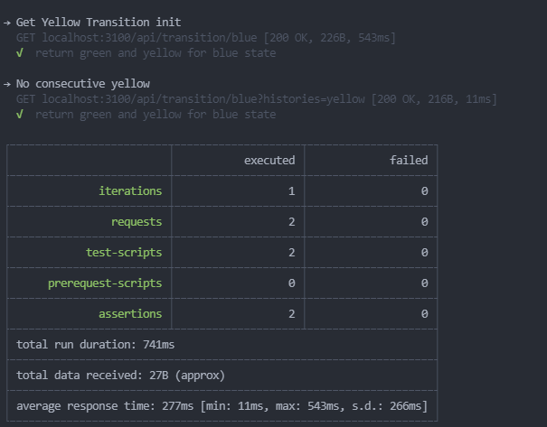

Inspired from [Microsoft nodejs starter](https://github.com/microsoft/TypeScript-Node-Starter) but use HapiJs and remove FE sections

# RESTful APIs
| verb | url                                 | description         |
| ---- | ----------------------------------- | ------------------- |
| GET | /transition/:nextStep?histories=blue | get next transition |


# Technical stack
Generic stack:
* nodejs, typescript
* RESTful API hapi, swagger
* mongo, mongoose
* jest for testing, code coverage 90%
* winston for logging

Each service follow 3 layer architecture:
* Presentation layer:
  * Api: hapi
  * validation: joi
* Business layer:
* Data layer:
  * mongo, mongoose
  * data migration: migrate-mongo
  * testing: mongodb-memory-server

folder structure in each service
```
+-- src
|   +-- module.campaigns
|   |   +-- routes
|   |   +-- validations
|   |   +-- controllers
|   |   +-- services
|   |   +-- repositories
|   |   +-- models
```

# Testing
* unit testing run `yarn test` or `yarn watch-test`
* end to end testing using postman or newman, the collection is provided in `postman` folder
  * Execute postman_local.bat 